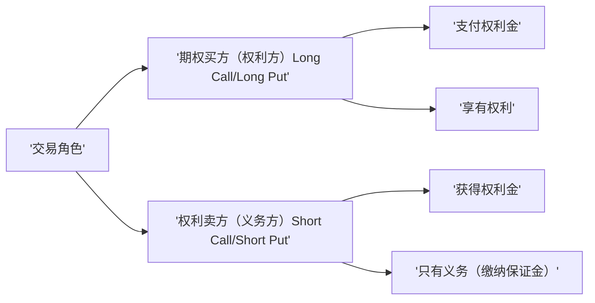
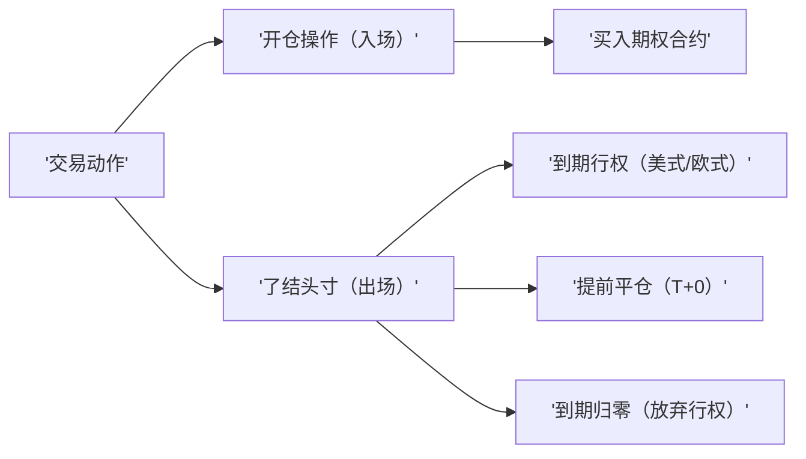

# FBDQA第七次课程
# 期权
## 名词术语
- 标的 Underlying
- 现货 Physicals
- 买方 Long/Buy 卖方 Short/Sell
- 行权 Exercise 行权价 Exercise Price
- 交割 Delivery
- 到期时间 Expiration Date
- 权利金 Premium
- 认购期权 Call Option 认沽期权 Put Option
- 欧式期权 European Option 美式期权 American Option
- 虚值期权 out-of-the-money 实值期权 in-the-money 平价期权 at-the-money
- 内在价值 Intrinsic Value 时间价值 Time Value 
- 损益图 Payoff
- 隐含波动率 Implied Volatility
- 买入认购 Buy Call 卖出认购 Sell Call
- 买入认沽 Buy Put 卖出认沽 Sell Put
- 牛市价差 Bull Spread 熊市价差 Bear Spread
- 备兑策略 Covered Call
- 期权保险策略 Protective Put
- 跨式 Straddle 宽跨式 Strangle
- $\delta$
- $\gamma$
- $\text{vega}$
- $\theta$
- $\rho$

## 复习
### 期货
- 英文名是Futures，与现货完全不同，现货是实实在在可以交易的货（商品），期货主要不是货，而是以某种大众产品如棉花、大豆、石油等及金融资产如股票、债券等为标的的标准化可交易合约。因此，这个标的物可以是某种商品（例如黄金、原油、农产品），也可以是金融工具。

### ETF
- ETF是一种跟踪“标的指数”变化、且在证券交易所上市交易的基金

## 期权基本知识
- 期权是一种在现货、期货或指数等品种基础上的金融衍生品，它是在未来某个时刻以特定价格买入或卖出某项标的资产的权利

### 种类
- 认购期权（看涨期权）（Call Option）：约定时间/价格买入标的的权利
- 认沽期权（看跌期权）（Put Option）：约定时间/价格卖出标的的权利

### 行权分式
- 欧式期权
  - 只能在到期日当天行使权利的期权
- 美式期权
  - 到期前任何一天都可以行使权利的期权

### 期权的行权方式
- 现货交割：股票/ETF
- 期货交割：商品期货的多头/空头
- 现金交割：股指期货

## 期权合约交易
- 期权合约 英语为：option contract；简称option。期权合约产生于1973年芝加哥期权交易。
- 期权合约以金融衍生产品作为行权品种的交易合约。指在特定时间内以特定价格买卖一定数量交易品种的权利。
- 合约买入者或持有者(holder)以支付保证金——期权费(option premium)的方式拥有权利；合约卖出者或立权者(writer)收取期权费，在买入者希望行权时，必须履行义务

### 合约要素
- 合约标的：上交所：华夏上证50ETF（510050.SH）、华泰柏瑞沪深300ETF（510300.SH）、新增中证500ETF（510500.SH）；深交所：嘉实沪深300ET（159919.SZ）、新增创业板ETF（159915.sz）、中证500ETF（159922.SZ）和深证100ETF（159901.SZ）
- 合约类型：认购期权和认沽期权
- 合约单位：10000份
- 合约到期月份：当月、下月及随后两个季月
- 行权价格：多个（平值合约、虚值合约、实值合约）
- 行权方式：到期日行权（欧式）
- 交割方式：实物交割（业务规则另有规定的除外）
- 到期日：到期月份的第四个星期三（遇法定节假日顺延）
- 认购合约申报行权的条件：认购合约行权，客户衍生品资金账户在行权日15:30前需有足额可用资金，所需资金=行权价* 行权数量 *合约单位
- 认沽合约申报行权的条件：客户普通证券账户收盘前需有足额可用标的证券，所需证券数量=合约单位*行权数量。当日买入的标的证券可用于行权
### 到期损益图
以到期时标的的价格为横轴，以到期时期权合约的总盈亏为纵轴，逐一描点作图，就得到了到期损益图（到期收益曲线）

- 最大风险
  - 以买入认购期权为例：最坏情况下（持续下跌）损失掉认购期权的全部权利金
- 最大收益
  - 以买入认购期权为例：只要标的价格上升，理论上，最大收益就没有上限

## 期权的基础交易策略

### 期权的四大交易策略

|类型\角色|买方（BUY）|卖方（SELL）|
|---|---|---|
|认购期权（CALL）|1. 买入认购期权（Buy Call/Long Call）|2. 卖出认购期权（Sell Call/Short Call）|
|认沽期权（PUT）|3. 买入认沽期权（Buy Put/Long Put）|4. 卖出认沽期权（Sell Put/Short Put）|

## 期权定价和主要影响因素
### 合约的虚实状态和价格分解
- 根据标的价格与其行权价的相对高低，把期权合约划分为三种状态：实值期权、平值期权、虚值期权

- 期权价格=内在价值+时间价值

- 内在价值
  - 假设期权当前立即到期，买方通过选择是否行权所获取的收益。
  - 认购期权(S 代表标的资产的价格，K 代表期权合约的行权价)
    - S-K,S > K(实值)
    - 0,S <= K(平值/虚职)
  - 认沽期权(S 代表标的资产的价格，K 代表期权合约的行权价)
    - K-S,S < K(实值)
    - 0,S >=K (平值/虚职)
- 时间价值
  - 买方支付的权利金中超出当前内在价值的部分，也是买方为了赚取未来市场可能的上涨/下跌带来的收益而愿意付给卖方的成本，换取的是一种盈利的可能性。
  - 时间价值=期权价格-内在价值

### 期权合约的定价
- 期权定价公式：B-S模型

- 假设
  - 标的资产为某风险资产，且其价格S的波动服从几何布朗运动$\frac{dS}{S}=\mu dt+\sigma dz$
  - 在期权有效期内，标的资产没有现金收益支付
  - 市场无摩擦，即不存在税收和交易成本
  - 标的资产允许卖空，且所有证券都是无限可分的
  - 在期权有效期内，无风险利率为常数，可以此利率无限制地借贷
  - 该期权是欧式期权，即在期权到期前不可实施
  - 市场不存在无风险套利机会

#### Black-Scholes模型

- 认购期权价格

$$
c=SN(d_1)-Ke^{-r(T-t)}N(d_2) \\
$$

- 认沽期权价格

$$
p=Ke^{-r(T-t)}N(-d_2)-SN(-d_1) \\
$$

- 其中

$$
d_1=\frac{\ln(\frac{S}{K}+(r+\frac{\sigma^2}{2})(T-t))}{\sigma\sqrt{T-t}} \\
d_2=d_1-\sigma\sqrt{T-t} \\
$$

- c:认购期权价格
- p:认沽期权价格
- S:标的的资产价格
- K:期权行权价
- T-t:临到期时间
- r:无风险利率
- $\sigma$:标的价格年化波动率
- N:标准正态分布变量的累计概率分布

#### 隐含波动率
从B-S模型可以看出，标的价格的波动率是衡量期权价格的重要因素之一，因为波动率的上升增加了期权变为实值的可能性，所以为该期权所付的权利金也应相应地增加

- 隐含波动率（Implied Volatility，简称IV）是指在期权有效期内标的资产实际的波动率
- 相对于当前时刻而言，它是一个未知量，所以被称作“隐含波动率”
- 隐含波动率可以将某一个期权合约的成交价（权利金）及其它几个参数输入期权定价模型，通过计算得到

含义

- 隐含波动率反映了市场对未来标的价格波动的看法或预期，是市场情绪的体现
- 当隐含波动率上升，代表投资者预期标的价格波动将扩大，因此权利金也会上涨；反之权利金则会下跌

### 影响期权价格的三个主要因素
期权价格变化 $\approx$ 价格风险 + 波动率风险 + 时间流逝风险

相关性

|期权价值|标的价格|波动率|时间|
|---|---|---|---|
|认购期权|+|+|+|
|认沽期权|-|+|+|

## 期权交易的功能和特点
作用：
- 做趋势
- 做波动
- 赚时间
- 安全垫
- 锁风险
- 买彩票
- 高杠杆

特点：
- 适用于各种行情
- 多维度的获利途径
- 灵活多样的策略及其组合
- 高杠杆非线性工具

## 期权的四大基本交易策略
期权的四大交易策略

|类型\角色|买方（BUY）|卖方（SELL）|
|---|---|---|
|认购期权（CALL）|1. 买入认购期权（Buy Call/Long Call）|2. 卖出认购期权（Sell Call/Short Call）|
|认沽期权（PUT）|3. 买入认沽期权（Buy Put/Long Put）|4. 卖出认沽期权（Sell Put/Short Put）|

获利模式

- 高杠杆博方向（买彩票）
  - 看涨/看跌
- 赚取时间价值（废报纸）
  - 看不涨/看不跌
- 波动率交易
  - 买跨/卖跨

四大策略适用场景

|标的资产价格|波动率上升|波动率下降|
|---|---|---|
|上涨|1. 买入认购期权（Buy Call/Long Call）|4. 卖出认沽期权（Sell Put/Short Put）|
|下跌|3. 买入认沽期权（Buy Put/Long Put）|2. 卖出认购期权（Sell Call/Short Call）|

### 买入看涨期权
适用场景：
- 看大涨，短期内急涨
策略优势：
- 方向做反，损失有限
- 杠杆效应，以小博大
- 资金占用少，不需要保证金
策略劣势：
- 时间价值持续衰减对买方不利
- 波动率下降对买方不利
- 胜率低，不可买入太多

### 买入看跌期权
适用场景：
- 看大跌，短期内急跌
策略优势：
- 方向做反，损失有限
- 杠杆效应，以小博大
- 资金占用少，不需要保证金
策略劣势：
- 时间价值持续衰减对买方不利
- 波动率下降对买方不利
- 胜率低，不可买入太多

### 卖出看涨期权
适用场景：
- 看不涨，赚取时间价值和
波动率下降的利润
策略优势：
- 先收取权利金
- 赚取时间价值是确定的
- 卖方有概率优势，尤其是卖虚值期权，容错性好
策略劣势：
- 最大收益有限
- 遇到大跌，收益小于买沽
- 如果大幅上涨，损失惨重

### 卖出看跌期权
适用场景：
- 看不跌，赚取时间价值和
波动率下降的利润
策略优势：
- 先收取权利金
- 赚取时间价值是确定的
- 卖方有概率优势，尤其是
卖虚值期权，容错性好
策略劣势：
- 最大收益有限
- 遇到大涨，收益小于买购
- 如果大幅下跌，损失惨重

### 重点
- 对趋势方向的判断
- 对波动率变化趋势的判断
- 对时间价值衰减因素的估计

## 期权的组合策略
牛市差价策略的目标

- 适用场景
  - 对标的是长期看涨的，但不会无限上涨
  - 短期可能有波动，甚至会有回调
- 目标
  - 在回调时要避免收益大幅回撤
  - 长期获得标的上涨带来的收益

熊市差价策略的目标

- 适用场景
  - 对标的是长期看跌的，但不会无限下跌
  - 短期可能有波动，但总体趋势是下跌
- 目标
  - 在标的资产价格上涨时避免损失
  - 在标的资产价格下跌时获得收益
  - 通过卖出期权部分抵消买入期权的成本，从而降低策略的总成本

### 牛市差价策略
- 买入一份行权价较低的认购期权
  - 通常选择平值或轻度实值（1-2档）认购期权
- 同时卖出一份到期日相同、行权价格较高的认购期权
  - 通常选择轻度虚值（1-2档）认购期权

### 熊市价差策略
- 买入一份行权价较高的认沽期权
  - 通常选择平值或轻度实值（1-2档）认沽期权
- 同时卖出一份到期日相同、行权价格较低的认沽期权
  - 通常选择轻度虚值（1-2档）认沽期权

## B-S模型
Black-Scholes模型

认购期权价格

$$
c=SN(d_1)-Ke^{-r(T-t)}N(d_2) \\
$$

认沽期权价格

$$
p=Ke^{-r(T-t)}N(-d_2)-SN(-d_1) \\
$$

对期权价格公式继续泰勒展开，并且忽略高阶项

$$
\Delta c=\frac{\partial c}{\partial S}\Delta S+\frac{\partial c}{\partial t}\Delta t+\frac{\partial c}{\partial \sigma}\Delta \sigma+\frac{\partial c}{\partial r}\Delta r+\frac{1}{2}\frac{\partial^2 c}{\partial S^2}\Delta S+\ldots \\
$$

期权价格的变化 $\approx$ Delta * 标的变化 + 0.5 * Gamma * 标的变化的平方 + Theta * 时间变化 + Vega * 波动率变化 + Rho * 无风险利率变化

- Delta ($\delta$)：衡量标的资产价格变动时，期权价格的变化幅度
- Gamma ($\gamma$)：衡量标的资产价格变动时，期权Delta值的变化幅度
- Vega ($\nu$)：衡量标的资产价格波动率变动时，期权价格的变化幅度
- Theta ($\theta$)：衡量随着时间的流逝，期权价格的变化幅度
- Rho ($\rho$)：衡量无风险利率变动时，期权价格的变化幅度

## 买方和卖方的风险控制
### 买方的风险控制
“财不入急门，知不可为时则不为” 

- 买方亏损的主要原因
  - 方向猜错了
  - 方向猜对，但是波动率下降明显
  - 方向猜对，但是时间价值衰减很快
  - 方向猜对，但是合约选择的不好
- 买方的理论风险：有限（最多亏损权利金）
- 买方的风险控制：本质上是仓位控制（轻仓买彩票）

### 卖方的风险控制
卖方策略胜率高，但是要防黑天鹅

- 卖方亏损的主要原因
  - 方向猜错
  - 遇到小概率黑天鹅事件，波动率暴增（相当于保险出险了）
  - 卖方的理论风险：无限（开保险公司需要精算）
- 卖方的风险控制：
  - 核心是回避黑天鹅事件，要维护“市场日历”
  - 合约的选择
  - 仓位的控制

## 期权引用与实战案例分析

### 备兑开仓
备兑开仓是最常用的期权组合策略

- 操作方式：买入一个标的证券的同时，卖出一个相对应的认购期权。
- 特点：虽然可以赚取权利金降低持仓成本，但是，如果股票上涨，期权相应上涨，认购期权的买方要求行权，则备兑开仓的投资者需要履行义务，相当于买入标的所得与认购期权行权成本相抵，最大收益为权利金。
- 为什么还要采用备兑开仓策略：市场大部分时间没有急涨，而是缓涨缓跌；A股更是牛短熊长。

### 保险策略
操作方式：又称保护性买入认沽期权策略。在已经拥有标的证券、或者买入标的证券的同时，买入一一个相对应的认沽期权。
- 特点：相当于为持有的证券买了“下跌保险”。实际付出的总成本是买入证券的成本加上买入认沽期权付出的权利金。认沽期权的权利金就是为证券下跌买的保险。
- 选择什么样的保险：平衡期权的收益与成本，通常选择轻度实值、平值、或轻度虚值的认沽期权合约。

### 买彩票（看大跌）
做买方，看方向以小博大

考虑因素：
- 标的资产价格变化的方向
- 时间价值的衰减
- 波动率的变化方向
- 虚实的选择：潜在收益空间与权利金成本的平衡？
- 计划持有期权合约的时间：做短线还是做长线？
### 卖废纸（看不涨）

### 做多波动率策略
买入跨式(Straddle)又被称为“同价对敲”
  - 买入数量相同、到期日相同、行权价相同的认购和认沽期权
  - “不猜方向”：预计后市会大汇总那个或大跌
  - 预计将发生影响很大的不确定性事件
- 买入宽跨式（Strangle）
  - 同时买入虚值认购和虚值认沽期权
  - 为什么买虚值合约：低成本，高杠杆

### 做空波动率策略
- 卖出跨式
- 卖出宽跨式
  - 预期波动率下降
  - 市场环境稳定
  - 时间价值衰减
  - 风险承受能力
  - 保证金要求

## 期权末日轮
- 期权合约到期日当天，平值期权时间价值较小，买入成本低，且Gamma非常大，标的波动一点儿，期权合约可能就会波动很多倍
- 如果预期当天标的波动幅度很大，则可同时买入认购和认沽合约（最好前一天收盘或当天开盘时标的价格处于某一行权价附近），仓位要轻
- 参与末日轮不要做卖方！卖方的潜在损失无上限！
- 一旦标的有大的波动，某个方向期权合约有较大涨幅，务必及时止盈
- 到期日收盘前实值的合约务必要平仓，避免自动行权（额外资金要求）
- 参考：四巫日
